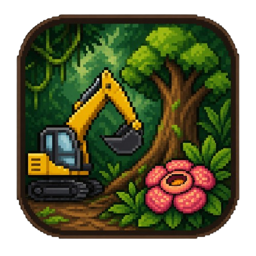
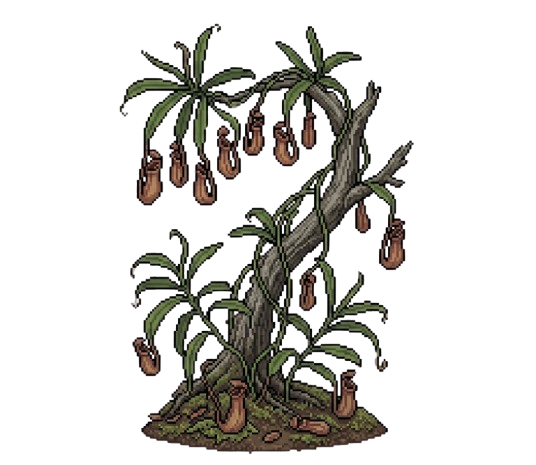
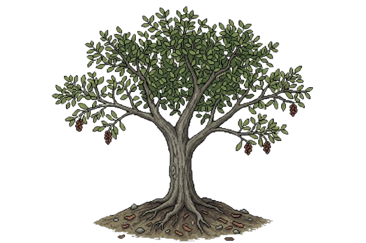
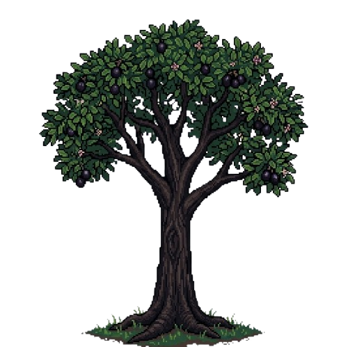
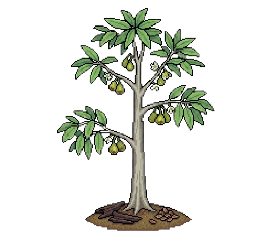
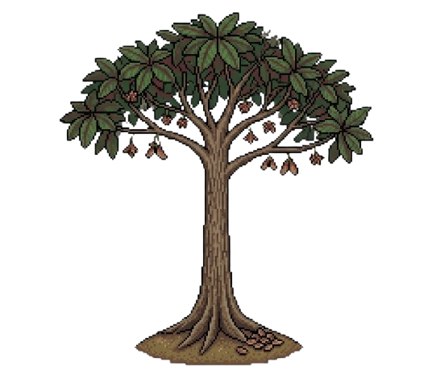
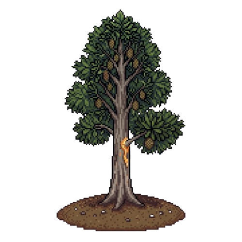
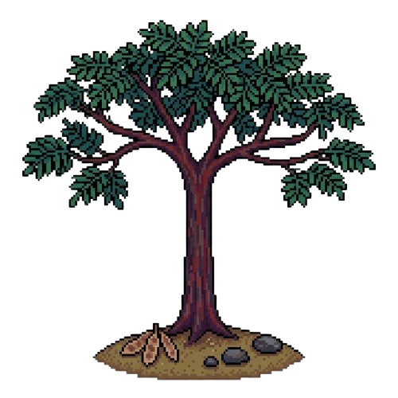
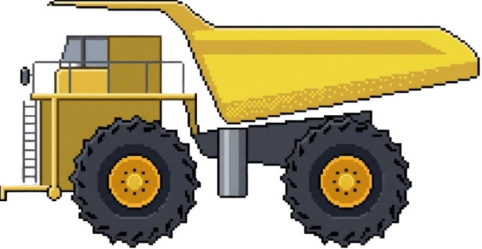
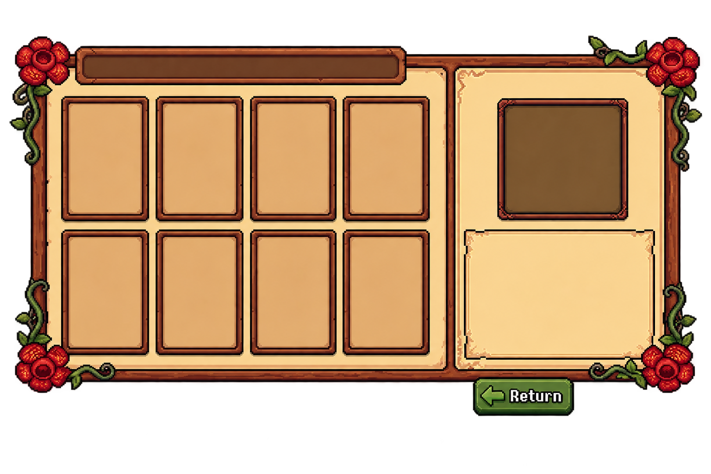

<div align="center">
  
  <h1>DON'T CUT IT</h1>
  <p><strong>Tropical Rainforest Lane Defense</strong></p>
  <p>Game edukasi lane-defense berbasis Flutter tentang perlindungan hutan hujan tropis Indonesia.</p>
</div>


## Tentang game

Pemain melindungi hutan dari alat berat yang bergerak dari kanan menuju kawasan hutan melalui tiga jalur. Pertahanan dilakukan dengan Rafflesia sebagai penyerang utama dan tanaman tropis Indonesia yang dapat ditanam pada petak arena.

Game menggabungkan strategi lane-defense, penyusunan deck tanaman, sistem gelombang, koleksi kartu benih, dan ensiklopedia flora.

## Gameplay yang sudah tersedia

- Arena terdiri dari **3 jalur** dan grid tanam **7 x 3** atau 21 petak.
- Rafflesia dapat dipindahkan vertikal antarlajur dan menembakkan proyektil.
- Pemain memilih **1 sampai 5 tanaman** melalui Book sebelum bermain.
- Setiap tanaman di deck dimulai dengan **2 kartu**.
- Musuh yang dikalahkan memiliki **70% peluang** menjatuhkan kartu tanaman dari deck aktif.
- Kartu jatuh dapat dikoleksi lalu digunakan untuk menanam pada petak kosong.
- Hutan memiliki **3 HP**. Musuh yang berhasil menembus pertahanan mengurangi HP tersebut.
- Game mendukung pause, resume, kembali ke home, How to Play, pengaturan audio, dan reset progress dengan konfirmasi.
- Deck, progress stage, skor, benih, serta pengaturan backsound/SFX disimpan secara lokal.

## Tanaman

Terdapat delapan flora yang dapat dipilih. Masing-masing mempunyai HP, cooldown, kemampuan, nama ilmiah, status konservasi, dan informasi edukasi sendiri.

| Asset | Flora | Kemampuan |
|---|---|---|
|  | Bunga Bangkai (*Amorphophallus titanum*) | Corpse Cloud |
|  | Kantong Semar (*Nepenthes* sp.) | Pitcher Trap |
|  | Cendana (*Santalum album*) | Scent Aura |
|  | Eboni Sulawesi (*Diospyros celebica*) | Deep Root |
|  | Gaharu (*Aquilaria malaccensis*) | Healing Resin |
|  | Meranti Merah (*Shorea leprosula*) | Canopy Shield |
|  | Damar (*Agathis dammara*) | Resin Goo |
|  | Sonokeling (*Dalbergia latifolia*) | Crimson Rosewood Shard |

## Musuh

| Asset | Musuh | HP | Damage | Kecepatan | Skor |
|---|---|---:|---:|---:|---:|
|  | Traktor Penebang | 4 | 2 | 38 px/s | 150 |
|  | Truk Kayu Gelondongan | 5 | 1 | 28 px/s | 250 |
|  | Ekskavator Tambang dan Lahan | 3 | 3 | 20 px/s | 400 |

## Cara bermain

1. Buka **Book** dari menu utama.
2. Pilih maksimal lima tanaman untuk deck.
3. Tekan **Play** untuk memulai stage pertama.
4. Pindahkan Rafflesia ke jalur musuh untuk menyerang.
5. Kalahkan musuh dan ambil kartu tanaman yang jatuh.
6. Pilih kartu pada inventory, lalu klik petak kosong untuk menanam.
7. Manfaatkan kemampuan setiap flora dan pertahankan 3 HP hutan sampai gelombang terakhir.

Panduan visual juga tersedia dari tombol How to Play di dalam game.

## Ensiklopedia dan deck

Book menampilkan seluruh delapan flora. Pemain dapat membuka detail nama Indonesia, nama ilmiah, status konservasi, deskripsi, HP, dan kemampuan. Tombol Equip/Unequip mengatur deck aktif dengan kapasitas maksimal lima tanaman.



## Teknologi

- Flutter dan Dart
- Flutter Web sebagai target utama
- Game loop, collision, projectile, cooldown, wave, dan state management buatan project
- Penyimpanan lokal melalui `StorageService`
- UI berbasis asset gambar pixel-art
- Font lokal Lilita One dan Bree Serif

## Menjalankan secara lokal

Pastikan Flutter sudah tersedia, lalu jalankan:

```powershell
flutter pub get
flutter run -d chrome
```

Alternatif web server:

```powershell
flutter run -d web-server --web-hostname 127.0.0.1 --web-port 8090
```

## Verifikasi

```powershell
flutter analyze
flutter test
```

## Struktur project

```text
lib/
|-- game/
|   |-- models/
|   `-- game_state.dart
|-- screens/
|   |-- home_screen.dart
|   |-- game_screen.dart
|   |-- book_modal.dart
|   |-- how_to_play_modal.dart
|   `-- game_settings_modal.dart
|-- services/
|   |-- audio_service.dart
|   `-- storage_service.dart
`-- main.dart

assets/
|-- fonts/
`-- images/

test/
`-- game_test.dart
```

## Dokumentasi vibe coding

Riwayat prompt dan ringkasan perubahan selama pengembangan dicatat di [`log.md`](log.md).

> Pick your plants. Build your defense. Protect the rainforest.
